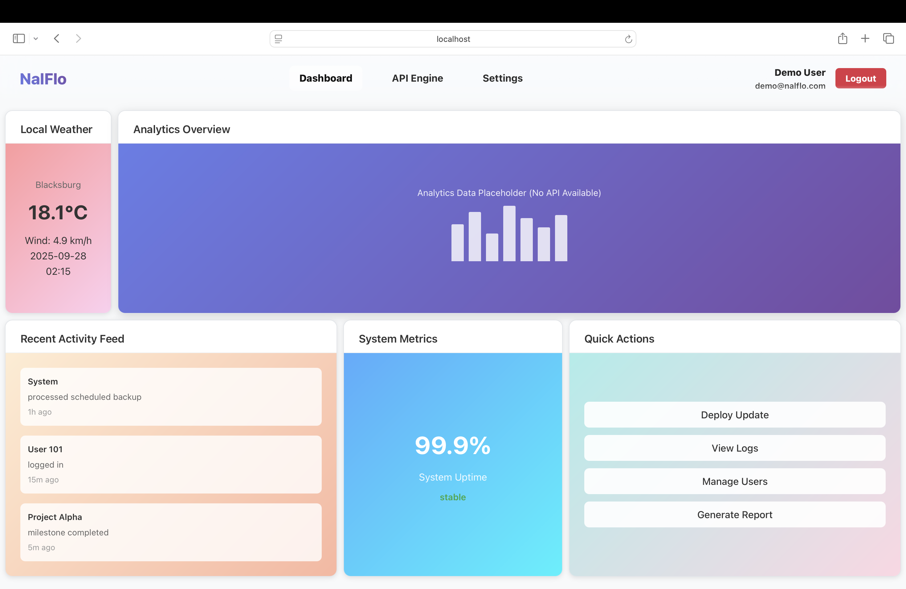
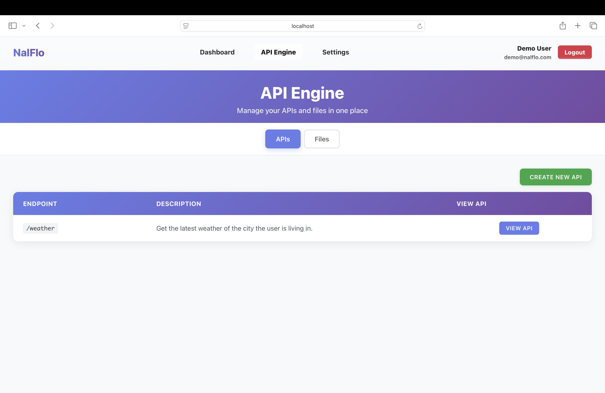
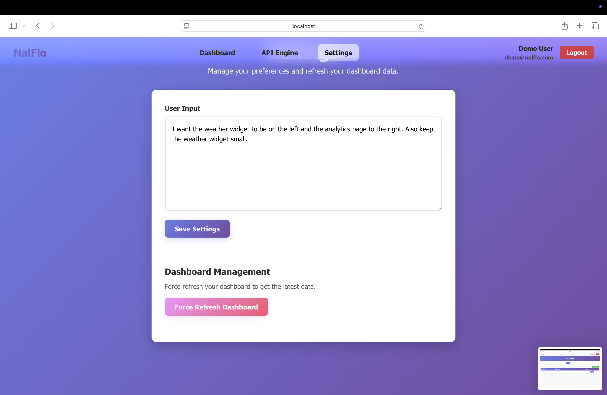

# VTHacks-Nalflo

## NalFlo

NalFlo is a modern AI-powered operations dashboard that dynamically organizes business-critical information into tiles, prioritizing size and placement based on relevance. It integrates with APIs to pull real-time data and present it in a unified, customizable interface.

## 🚀 Current Capabilities

- **AI-Driven Dashboard Layout** – Uses the Gemini API to decide tile importance, size, and placement.
- **Weather API Integration** – Live demo integration fetching real-time weather data.
- **System Activity Feed** – Displays mock system and project updates in a timeline format.
- **System Metrics** – Example uptime tile (99.9% system health).
- **Quick Actions** – Placeholder operations (Deploy Update, View Logs, Manage Users, Generate Report).
- **Auto Refresh** – Dashboard refreshes every 15 minutes or on-demand with Force Refresh.
- **User Preferences (Settings)** – Stores user customization settings for personalized dashboards.
- **Persistent Server Storage** – Current version stores state in JSON files.

## 🌱 Future Potential

### AI Chatbot Assistant
- Execute quick commands in natural language (e.g., "Deploy latest update," "Show last 5 logs").
- Summarize activity feeds and flag anomalies.

### Role-Based Access Control (RBAC)
- Granular permissions for admins, managers, and team members.

### Scalable Data Layer
- Migration from JSON to PostgreSQL/MySQL or other production-grade databases.
- Multi-tenant support for enterprises.

### Expanded API Engine
- CRM, ticketing systems, cloud monitoring, and finance integrations.

### Business Insights
- AI-driven analytics, automated reports, and proactive operational recommendations.

## 🛠️ Tech Stack

- **Frontend:** React + CSS
- **Backend:** Flask (API engine & server logic)
- **AI Integration:** Gemini API (dynamic dashboard generation)
- **Persistence:** JSON storage (future migration to relational DB)
- **APIs Integrated:** Weather API (demo-ready)

## 📸 Demo





## ⚡ Getting Started

1. **Clone the repo**
   ```bash
   git clone https://github.com/AnjanB3012/VTHacks-Nalflo.git
   cd nalflo
   ```

2. **Install frontend dependencies**
   ```bash
   cd frontend
   npm install
   ```

3. **Install backend dependencies**
   ```bash
   cd ../backend
   pip install -r requirements.txt
   ```

4. **Run backend server**
   ```bash
   python app.py
   ```

5. **Run frontend in a new terminal**
   ```bash
   cd frontend
   npm run dev
   ```

6. **Visit the app**
   ```
   http://localhost:3000
   ```

## 🔮 Roadmap

- [ ] Add multi-API integrations beyond weather.
- [ ] Implement AI chatbot actions.
- [ ] Introduce RBAC and enterprise-level user management.
- [ ] Migrate storage from JSON to production-grade DB.
- [ ] Deploy live (Heroku, Vercel, or cloud platform).
- [ ] Mobile companion app for real-time access.

## 👥 Contributors

Built overnight at VT Hacks by Anjan Bellamkonda, Rokeshuvaraj Nagarajan, Yoshwan Pathipati, Vamsi Muppala 🚀